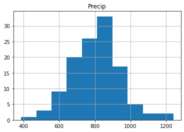
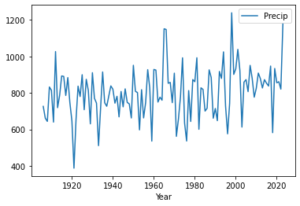

# Getting started with data analysis

# Background to this example

Data comes in all sorts and forms within Earth sciences, from long term paleo records describing Oxygen levels in the atmosphere, timeseries of river discharge and spatio-temporal satellite images monitoring the vegetation. Within Earth Sciences we work with all these types of data to understand the past, present and future of the Earth system. Before we can work with these types of data we need to understand what we can and cannot do with the data, which conclusion we can and cannot draw.

**In this practical we will start looking at different types of data and distributions of these data to get a better understanding of the different types of data and their distributions.**

Let's start with using Python again by opening your Conda environment and then opening Spyder (for detailed instructions please look back at the first practical). We start by loading some of the stand libraries in this course. We use:

-   Pandas (data management and data handling)

-   Numpy (statistical analysis and data handling)

-   Matplotlib (plotting)

-   Scipy (statistical analysis)

## Code

``` python
import pandas as pd
import matplotlib.pyplot as plt
import numpy as np
import scipy.stats as stats
```

Now we are going to take a look at the first dataset which contains information about the amount of precipitation in the Netherlands. We tell pandas to parse the date information, and use it as row labels:

``` python
precip = pd.read_csv("../Data/annualPrecipitation.csv", parse_dates=True, index_col=0)
```

In this dataset you find the annual sum of precipitation in the last century. The data is now stored in the variable *precip.* You can explore the data by looking at the data within this variable with:

``` python
precip.head()
```

``` python
      Precip
Year        
1906   726.3
1907   661.6
1908   644.0
1909   832.7
1910   814.4
```

Alternatively you can explore the data with the variable explorer that you find within Spyder


# Starting with Pandas data analysis

Next we go and look at the data by visualizing the data. Within Pandas there are multiple opportunities to explore and visualize the data. There are lots of resources to help you with using Pandas and provide nice tips, trick and examples. For example you can use a **cheat sheet** to quickly remember and double check which functions to use (e.g. <https://pandas.pydata.org/Pandas_Cheat_Sheet.pdf>). You can also find lots of good examples that use Pandas online for different types of data and types of analysis (<https://realpython.com/search?q=pandas>).

## Normal distributions

On of the first things we often do is test if data follows a Gaussian distribution and is thus normally distributed. This typically means that the sample we have obtained is the result of many random sample from a distribution. Common example are the height or weight of people, but it is also very common in many examples in the Earth sciences like air temperature.

### Central limit theorem

In research, to get a good idea of a population mean (\$\\mu\$), ideally you'd collect data from multiple random samples within the population. A **sampling distribution of the mean** is the distribution of the means of these different samples.

From probability theory, we know the following asymptotic statements:

-   Law of Large Numbers: As you increase sample size (or the number of samples), then the sample mean will approach the population mean.

-   Central limit theorem: With multiple large samples, the sampling distribution of the mean is normally distributed, even if your original variable is not normally distributed.

Parametric statistical tests typically assume that samples come from normally distributed populations, but the central limit theorem means that this assumption isn't necessary to meet when you have a large enough sample.

You can use parametric tests for large samples from populations with any kind of distribution as long as other important assumptions are met. It depends on how heterogenous your data is, but large samples in the earth sciences can range from 30 records to 10.000 of thousands of observations.

### Testing if your data is normally distributed

You can test if a dataset is normally distributed, either with a visual inspection of the data or a statistical test. Below we will explore both options.

#### Question 1

*Let's start with a visual inspection. A good way to start is to make a histogram of you data. Use the cheat sheet to explore which function to use to make a histogram of the precipitation data.*

If you did it well you will find something like the image below, with the x-axis giving the different bins for annual precip ranging from roughly $400-1200~mm~y^{-1}$. The y-axis gives the number of years in each bin. You can see some of the distinct bell-shape that is to be expected from a normal distribution, but we can dive in a bit further.

{width="497"}

Another way is making a quantile-quantile plot of your data.

``` python
from statsmodels.graphics.gofplots import qqplot
## For the quantile plot, we need to extract the column from the dataframe that contains the precipitation data. You can get the column names of a dataframe df using df.columns. Here, we have only one column named "Precip", containing precipitation data."
qqplot(precip["Precip"], line='s')
```


In the figure you see the theoretical quantiles of the normal distribution and how the data (y-axis) relates to that. If the data is perfectly normally distributed it would fall on the red line.

#### Question 2

*Would you say the data is normally distributed based on this visual inspection of the data and why?*

There is also a more quantitative way of checking if data is normally distributed, which is using a statistical normality test. One of the more commonly used test for this is the Shapiro Wilk Test. The [Shapiro-Wilk test](https://en.wikipedia.org/wiki/Shapiro–Wilk_test) evaluates a data sample and quantifies how likely it is that the data was drawn from a Gaussian distribution, named for Samuel Shapiro and Martin Wilk. In practice, the Shapiro-Wilk test is believed to be a reliable test of normality, although there is some suggestion that the test may be suitable for smaller samples of data, e.g. thousands of observations or fewer. Note that the Shapiro-Wilk test examines the null hypothesis that the data is normally distributed. If it returns a p value lower than 0.05, the null hypothesis "the data follows a normal distribution" is rejected.

#### Question 3

*Try to implement the Shapiro Wilks test in Python on the precip dataset. You can use the function stats.shapiro, for which you find the manual here: <https://docs.scipy.org/doc/scipy/reference/generated/scipy.stats.shapiro.html>.*

If you did everything well you find that:

``` python
ShapiroResult(statistic=0.9821208214707591, pvalue=0.11845170228364588)
```

Since the p-value is above 0.05 we can assume that the data follows a normal distribution and is thus normally distributed.

## Testing if two samples have the same mean

Let's start by exploring some statistical properties of the rainfall data, starting with the mean annual precipitation and its standard deviation.

``` python
print(precip.mean())
print(precip.std())
```

``` python
Precip    802.147458
dtype: float64
Precip    139.186794
dtype: float64
```

You can see that the Netherlands has a mean $\pm$ standard deviation (1 $\sigma$) of around $802\pm139~mm~y^{-1}$ precipitation. This amount varies year by year, and thus it can matter how many years of data you have to get the mean values. One of the important element is the amount of years of observations that are available. **We will now explore the impact of the length of the data record on the value we find for the average annual precipitation.**

#### Question 4

*Can you now make a piece of code that identifies how many year of data we have? There are two ways of exploring this, which can be using a function that checks the [length]{.underline} or the [shape]{.underline} of the Pandas array (you can use Google to help you).*

If you did everything well you found that the total data record contains 118 years of data. For now we assume that the value of 800mm per year is the [true mean]{.underline} (µ) value of the annual precipitation in the Netherlands. Next we want to explore how many years of observations are needed to find the true value of annual precipitation. We will now use sub-samples of the full data record to see how many years we need. **Let's start by sub-sampling some of the data and computing and testing if the [sample mean]{.underline} accurately captures the [true mean]{.underline} (for which we now assume to be the +/- 800mm of the full data record).**

``` python
samplePrecip = precip.sample(n = 5, replace = False, random_state=1)
```

``` python
      Precip
Year        
2000   932.4
1960   928.7
1965  1151.9
2021   861.3
1980   861.8
```

*replace = False* indicates that every year should be only selected once and no years should be sampled twice. *random_state=1* is a way of guaranteeing that the same random numbers are selected and thus the same random years (this is mostly convenient if you want to reproduce your code, like for this practical). Now we would like to see if the average value that we obtain from the sample is a good representation of the total time series and thus represents the total [true mean]{.underline}.

``` python
samplePrecip.mean()
```

You will find that the mean precipitation for this sample is $947~mm~y^{-1}$, compared to the $802~mm~y^{-1}$ for the entire sample. You can see that these two values are different, but the question is if they are also statistically different. For this you will do an hypothesis test. The first step in constructing a hypothesis test is to be clear about what the null and alternative hypotheses are. This isn't too hard to do. Our null hypothesis $H_{0}$, is that the true population mean $\mu$ for annual precipitation is $802~mm~y^{-1}$; and our alternative hypothesis is that the population mean *isn't* $802~mm~y^{-1}$. If we write this in mathematical notation, these hypotheses becomes

$$
H_{0}:\mu_{1} = \mu_{2}\\
H_{1}:\mu_{1}\neq\mu_{2}
$$

though to be honest this notation doesn't add much to our understanding of the problem, it's just a compact way of writing down what we're trying to learn from the data. Before we can do this we need to make a couple of assumptions about the data:

1.  The two samples are independent

2.  The data is normally distributed

3.  The data have a similar variance

If you think these assumptions are valid we could use a t-test to test our hypothesis.

#### Question 5

*Do you think all of these criteria are met or do you see one that might be violated and if so why?*

For now let's assume all those criteria are met and we can move on and perform an independent sample t-test. While you can also do this by hand following the appropriate equations in this course we like to focus on using and analysing the data rather than focussing on the exact mathematical equations. It is however important to understand when you can and can't use a certain test of approach. Luckily the independent sample t-test is available from the Scipy packages (a common package for statistical analysis). You can perform the test using:

``` python
import scipy.stats as stats
stats.ttest_ind(precip, samplePrecip)
```

``` python
TtestResult(statistic=array([-2.29273885]), pvalue=array([0.02359]), df=array([121.]))
```

Python will return three values to you, the first is the so-called t-statistic, the p-value which indicates the likelihood of $H_{0}$ to be true and df the degrees of freedom, the higher this value the more samples you typically used. In this situation you can see that the $H_{0}$ is rejected (p-value \< 0.05) and thus we use the alternative hypothesis $H_{1}$. This means that with just 5 years of precipitation data we cannot accurately estimate the average annual precipitation over the Netherlands for the Bilt.

#### Question 6

*Find the number of years required to accurately represent the annual precipitation in the Bilt (*$\mu_{1}$*).*

# Looking for trends in your data

With climate change meteorological variables are likely to change, we know that temperatures are increasing but what about precipitation. We could test this by looking splitting our long timeseries into multiple parts and checking if the mean annual precipitation is changing.

#### Question 7

*Make a timeseries plot of the data by using your cheat sheet and the .plot function.*



If all went well you find the plot above. By looking at the data there are no clear trends in the data. We can also do a more quantitative approach using techniques that you have used before in this assignment.

Make two sub-sample of the data one containing the first 30 years of the data and one containing the last 30 years of the data. You have two ways of doing so (look at you cheat sheet for Pandas). The first one is to use the .head() and .tail() functions.

``` python
firstYearsPrecip = precip.head(30)
lastYearsPrecip = precip.tail(30)
```

There is also another option using the .iloc() function:

``` python
firstYearsPrecip = precip.iloc[:30]
lastYearsPrecip = precip.iloc[-30:]
```

If you want to select specific year you can use:

``` python
firstYearsPrecip = precip.loc["1906":"1935"]
lastYearsPrecip = precip.loc["1994":"2023"]
```

The advantage of this method is that you can specify years you want to select. Also if they are not situated at the start of end of the timeseries. You can do the same with the *iloc* function, but in that case you do need to identify the exact row numbers of interest.

#### Question 8

*Make a small script that selects the first and last 30 years of data and then tests if the mean of the two dataset are different or not. In other words:*

$$
H_{0}:\mu_{1906-1935} = \mu_{1994-2023}\\
H_{1}:\mu_{1906-1935}\neq\mu_{1994-2023}
$$

# Investigating a new dataset

Now it is time to use the skills you have just obtained on a new dataset "*dailyTemperature.csv*".

#### **Please explore the following things**

1.  Plot the data as a timeseries

2.  Is this dataset normally distributed

    1.  Using a graphical method

    2.  Using the Shapiro test

3.  Explore graphically if there are trends and try to quantify the trends by comparing the period 1901-1930 to 1990-2019.

4.  Test is the the year 2021 was significantly warmer than 2022

#### Findings

If all went well you find that the data is not normally distributed, that there is a deviation from the normal distribution especially in the higher temperature values as can be seen from the plot below.


If you explored the data you will also see that there are strong trends in the temperature data as can be expected with climate change.

# Processing your timeseries data

There are some tricks that can help you to better work with your data. You might have seen that the temperature data you got was not with an annual timestep but was actually the daily data from the Bilt weather station. There are tricks to easily aggregate your time data to different timescales. For example you can compute the annual mean temperature with:

``` python
Tas = pd.read_csv("../Data/dailyTemperature.csv", parse_dates=True, index_col=0)
annualTas = Tas.resample("YE").mean()
```

``` python
                  Tas
Date                 
1901-12-31   8.783562
1902-12-31   8.245205
1903-12-31   9.166575
1904-12-31   8.933607
1905-12-31   8.713699
              ...
2020-12-31  11.688251
2021-12-31  10.481096
2022-12-31  11.572603
2023-12-31  11.790959
2024-12-31  10.002907

[124 rows x 1 columns]
```

You can also find the annual minimum and maximum temperatures in a fairly similar manner

``` python
annualMinTas = Tas.resample("YE").min()
annualMaxTas = Tas.resample("YE").max()
```

#### Question 9

*Explore if the annual mean, min and max temperature are normally distributed.*

#### Question 10

*Could you explain why some of these new annual data are normally distributed and the daily timeseries are not. If it helps try to plot the daily data for the year 2022 using the [loc]{.underline} and [plot]{.underline} functions*

#### Question 11

*Try and write the annual temperature data to a csv file. For this you can use the [.to_csv](https://pandas.pydata.org/docs/reference/api/pandas.DataFrame.to_csv.html) function to write the Pandas dataframe to a csv file.*

#### Question 12

*The final year has no complete data, what would you propose to do with the data from this year?*
