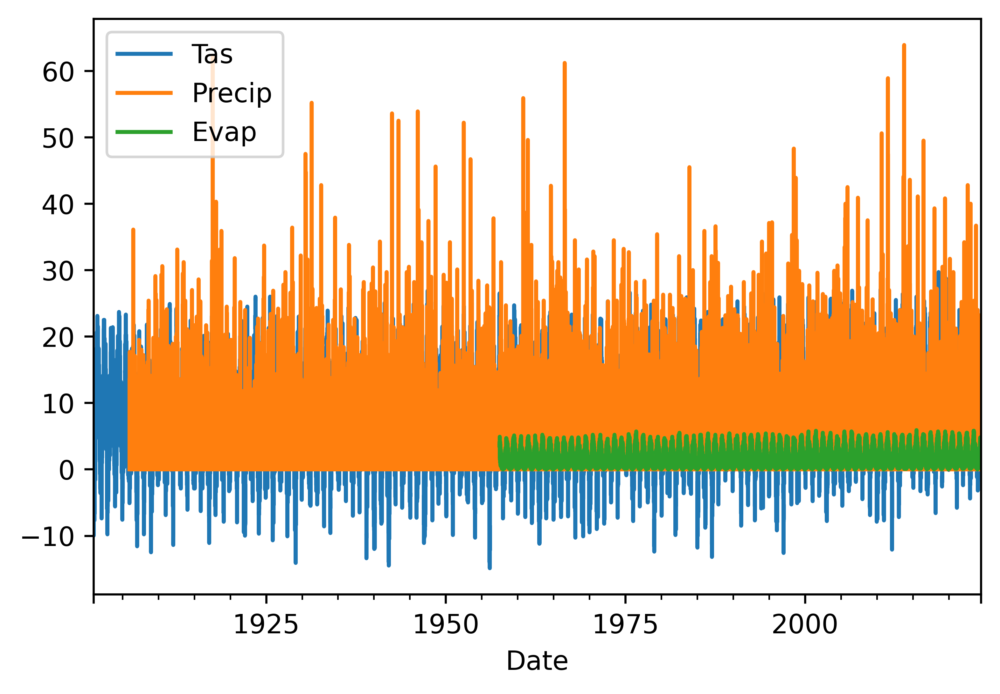

# Getting started with data analysis

# Background to this example

Data comes in all sorts and forms within Earth sciences, from long term paleo records describing Oxygen levels in the atmosphere, timeseries of river discharge and spatio-temporal satellite images monitoring the vegetation. Within Earth Sciences we work with all these types of data to understand the past, present and future of the Earth system. Before we can work with these types of data we need to understand what we can and cannot do with the data, which conclusion we can and cannot draw.

**In this practical we will start looking at different types of data and distributions of these data to get a better understanding of the different types of data and their distributions.**

Let's start with using Python again by opening your Conda environment and then opening Spyder (for detailed instructions please look back at the first practical). We start by loading some of the stand libraries in this course. We use:

-   Pandas (data management and data handling)

-   Numpy (statistical analysis and data handling)

-   Matplotlib (plotting)

-   Scipy (statistical analysis)

## Code

``` python
import pandas as pd
import matplotlib.pyplot as plt
import numpy as np
import scipy.stats as stats
```

Now we are going to take a look at the first dataset which contains information about the daily temperatures in the Netherlands. We tell pandas to parse the date information, and use it as row labels:

``` python
Tas = pd.read_csv("../Data/dailyTemperature.csv", parse_dates=True, index_col=0)
Pr = pd.read_csv("../Data/dailyPrecipitation.csv", parse_dates=True, index_col=0)
E = pd.read_csv("../Data/dailyEvaporation.csv", parse_dates=True, index_col=0)
```

We have now loaded three individual files that all contain meteorological information, however it is more powerful if we can join these datasets into one dataset where all the data is aligned to produce a dataframe where the different columns have the different meteorological variables for any given date between 1901 and now. To do this you can use the [join](https://pandas.pydata.org/docs/reference/api/pandas.DataFrame.join.html) function, this functions joins different dataframes based on their index, which in this case is a date, but can also be an integer or something else.

``` python
meteoData = Tas.join(Pr).join(E)
```

If you have done this you will now have one dataframe *meteoData* that contains Temperature, Precipitation and Evaporation data. The advantage of this dataframe is that now we can perform operations on the dataframe for all three variables combined or we can select data on a condition for one of the columns and automatically get the values for the other variables for the same dates. You can now also more easily look for dates that are for example dry and warm.

Now first let's look at some basic statistical properties of the data using the [describe](https://pandas.pydata.org/docs/reference/api/pandas.DataFrame.describe.html) function. It will give you things like the number of observations, the mean, standard deviation, min, max and quantile data.

``` python
meteoData.describe()

                Tas        Precip          Evap
count  45097.000000  43241.000000  24462.000000
mean       9.582449      2.202093      1.535635
std        6.288493      4.388798      1.321192
min      -14.900000      0.000000      0.000000
25%        5.100000      0.000000      0.400000
50%        9.800000      0.100000      1.200000
75%       14.500000      2.500000      2.400000
max       29.700000     63.900000      5.900000
```

As we saw during the lectures another way of looking at the data is plotting it to get a sense of what kind of data we are dealing with. One of the most basic functions for that is of course the plot function. So we can give that a try

``` python
meteoData.plot()
```



#### Question 1

*Why is this not very helpful. List at least three things you would like to improve about this visualization to better understand if the data make sense.*

``` python
meteoData[["Tas","Evap"]].plot(xlim=["2023","2024"], ylim=[-2,25])
```

#### Question 2

*This is a bit better but still not great. List at least three things you would like to improve about this visualization to better understand if the data make sense.*

``` python
meteoData["Precip"].plot(kind="hist")
```

#### Question 3

*This is histogram is helpfull, but does it tell you if the data is correct. Think about relevant metadata that is or isn't provided with the dataset. List two things that you are missing that would help you to see if these daily precipiation values make sense.*

``` python
meteoData["Precip"].plot(kind="density")
```

``` python
meteoData[["Precip", "Evap"]].plot(kind="hist",alpha=0.5, bins=100, xlim=[0,30])
```

``` python
meteoData.plot(kind="scatter",x="Tas", y="Evap")
meteoData.plot(kind="scatter",x="Tas", y="Evap", alpha=0.05)
```

``` python
annualData = meteoData[["Precip", "Evap"]].resample("YE").sum()
```

``` python
annualData.plot(kind="scatter",x="Precip", y="Evap")
```

What do you notice?

``` python
annualData.describe()
```

``` python
meteoData.dropna()
```

No data prior to 1957 and the data of 1957 is incomplete, so we drop all years up to 1957. But we do have to remember that the last year is also not complete so we also drop that.

``` python
annualData = meteoData[["Precip", "Evap"]].dropna().resample("YE").sum().loc["1958":"2023"]
annualData.index = annualData.index.strftime('%Y')
```

Attempt number 2

``` python
annualData.plot(kind="scatter",x="Precip", y="Evap")
```

``` python
annualData.plot()
```

``` python
annualData.plot(kind="hist", alpha=0.5, bins=20, color=["blue", "red"])
```

``` python
annualData["EvapDef"] = annualData["Evap"] * -1.
```

``` python
annualData[["Precip", "EvapDef"]].plot(kind="bar", color=["blue", "red"], stacked=True)
```

``` python
annualData["PrecipDef"] = annualData["Precip"] - annualData["Evap"]
```

``` python
annualData["PrecipDef"].plot()
```

``` python
annualData["PrecipDef"].plot(kind="hist")
```
