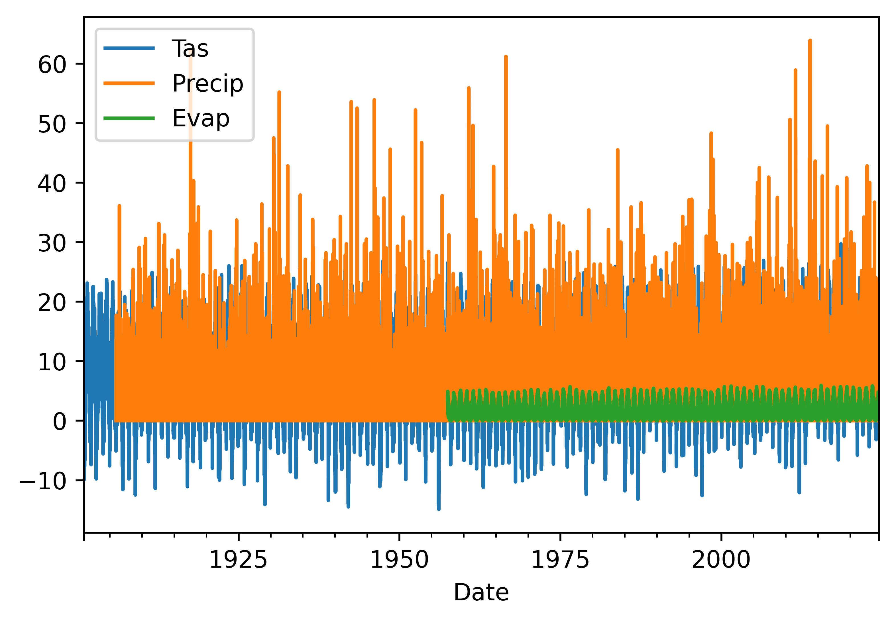
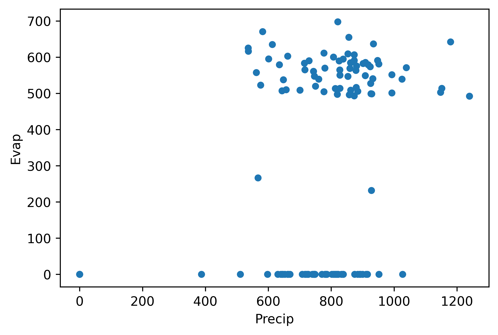
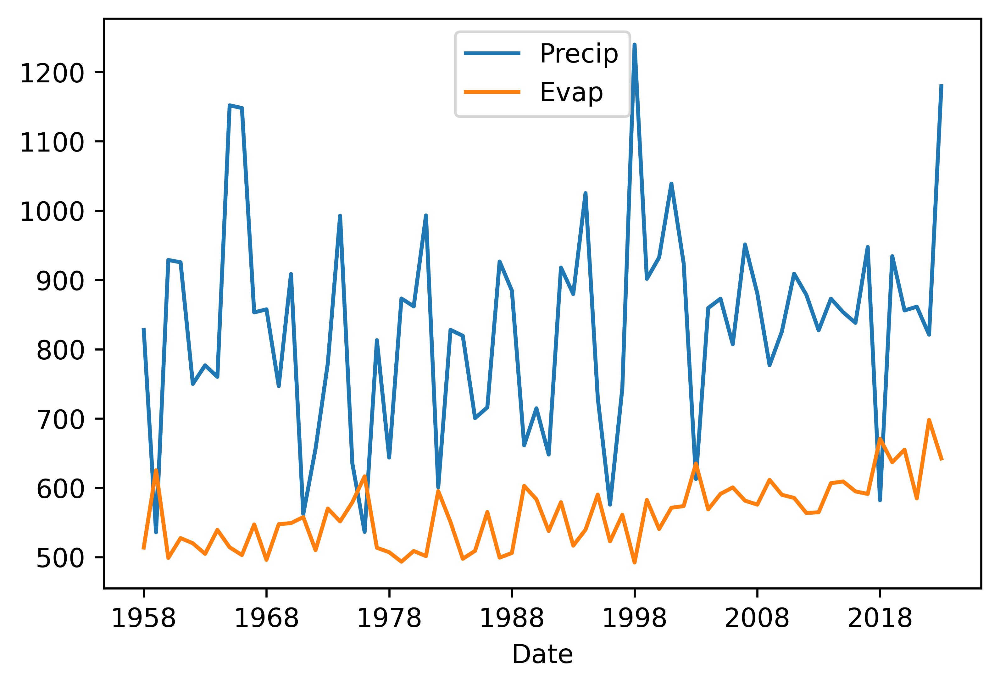
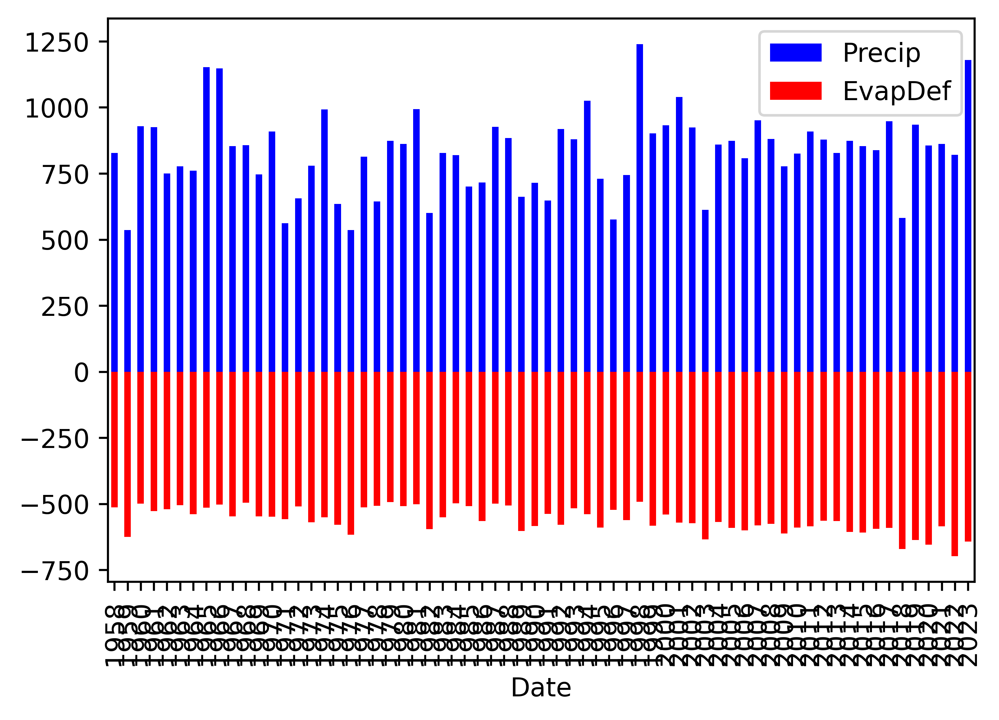
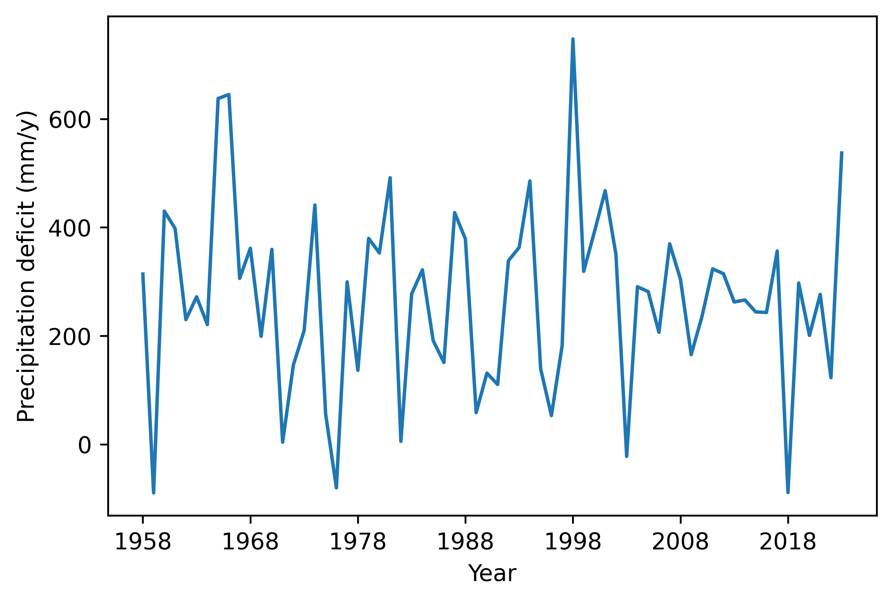
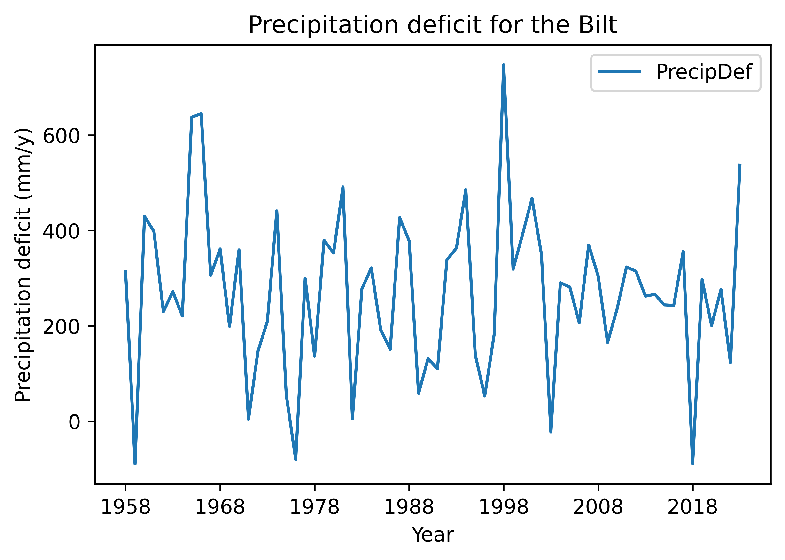

# Making visuals, graphs and figures of your data, as start

# Background to this example

Data comes in all sorts and forms within Earth sciences, from long term
paleo records describing Oxygen levels in the atmosphere, timeseries of
river discharge and spatio-temporal satellite images monitoring the
vegetation. Within Earth Sciences we work with all these types of data
to understand the past, present and future of the Earth system. Before
we can work with these types of data we need to understand what we can
and cannot do with the data, which conclusion we can and cannot draw.

**In this practical you will learn about**

-   **Visualizing data**

-   **What kind of figure to use**

# Getting started

Let's start with using Python again by opening your Conda environment
and then opening Spyder (for detailed instructions please look back at
the first practical). We start by loading some of the stand libraries in
this course. We use:

-   Pandas (data management and data handling)

-   Numpy (statistical analysis and data handling)

-   Matplotlib (plotting)

-   Scipy (statistical analysis)

``` python
import pandas as pd
import matplotlib.pyplot as plt
import numpy as np
import scipy.stats as stats
```

Now we are going to take a look at the first dataset which contains
information about the daily temperatures in the Netherlands. We tell
pandas to parse the date information, and use it as row labels:

``` python
Tas = pd.read_csv("../Data/dailyTemperature.csv", parse_dates=True, index_col=0)
Pr = pd.read_csv("../Data/dailyPrecipitation.csv", parse_dates=True, index_col=0)
E = pd.read_csv("../Data/dailyEvaporation.csv", parse_dates=True, index_col=0)
```

We have now loaded three individual files that all contain
meteorological information, however it is more powerful if we can join
these datasets into one dataset where all the data is aligned to produce
a dataframe where the different columns have the different
meteorological variables for any given date between 1901 and now. To do
this you can use the
[join](https://pandas.pydata.org/docs/reference/api/pandas.DataFrame.join.html)
function, this functions joins different dataframes based on their
index, which in this case is a date, but can also be an integer or
something else.

``` python
meteoData = Tas.join(Pr).join(E)
```

If you have done this you will now have one dataframe *meteoData* that
contains Temperature, Precipitation and Evaporation data. The advantage
of this dataframe is that now we can perform operations on the dataframe
for all three variables combined or we can select data on a condition
for one of the columns and automatically get the values for the other
variables for the same dates. You can now also more easily look for
dates that are for example dry and warm.

Now first let's look at some basic statistical properties of the data
using the
[describe](https://pandas.pydata.org/docs/reference/api/pandas.DataFrame.describe.html)
function. It will give you things like the number of observations, the
mean, standard deviation, min, max and quantile data.

``` python
meteoData.describe()

                Tas        Precip          Evap
count  45097.000000  43241.000000  24462.000000
mean       9.582449      2.202093      1.535635
std        6.288493      4.388798      1.321192
min      -14.900000      0.000000      0.000000
25%        5.100000      0.000000      0.400000
50%        9.800000      0.100000      1.200000
75%       14.500000      2.500000      2.400000
max       29.700000     63.900000      5.900000
```

As we saw during the lectures another way of looking at the data is
plotting it to get a sense of what kind of data we are dealing with. One
of the most basic functions for that is of course the plot function. So
we can give that a try

``` python
meteoData.plot()
```



#### Question 1

*Why is this not very helpful. List at least three things you would like
to improve about this visualization to better understand if the data
make sense.*

``` python
meteoData[["Tas","Evap"]].plot(xlim=["2023","2024"], ylim=[-2,25])
```

#### Question 2

*This is a bit better but still not great. List at least three things
you would like to improve about this visualization to better understand
if the data make sense.*

``` python
meteoData["Precip"].plot(kind="hist")
```

#### Question 3

*This is histogram is helpful, but does it tell you if the data is
correct. Think about relevant metadata that is or isn't provided with
the dataset. List two things that you are missing that would help you to
see if these daily precipitation values make sense.*

Let's make slightly different kind of histogram, the density plot. The
density plot uses interpolation and smoothing to approximate a histogram
and as such give a more smooth distribution.

``` python
meteoData["Precip"].plot(kind="density")
```

#### Question 4

*What can be a potential downside of the smoothing applied in a density
plot?*

We can also combine data into one histogram, which might be convenient
for plotting and comparing purposes. The code below gives an example.

``` python
meteoData[["Precip", "Evap"]].plot(kind="hist",alpha=0.5, bins=100, xlim=[0,30])
```

We can of course also make the well know scatter plots, where we compare
two variables against each other or look for relationships between these
two variables.

``` python
meteoData.plot(kind="scatter",x="Tas", y="Evap")
meteoData.plot(kind="scatter",x="Tas", y="Evap", alpha=0.05)
```

#### Question 5

*Which of these two scatter plots do you like best and why? What is the
advantage of using the alpha=0.05. Also play around with the alpha and
see which value you like best.*

# Combining data manipulation with visualization.

#### Question 6

*First Calculate the annual Precipitation and Evaporation sums and then
plot them against each other in a scatterplot. The end results should
look something like the figure below.*



#### Question 7

*Obviously something goes wrong but why, can you explain what happens?*

We can go back to the basic data and describe the dataframes and see
what happens.

``` python
annualData.describe()
meteoData.describe()
```

#### Question 8

#### *What do you notice or observe when comparing the describe summaries between the different variables?*

Run the code below and see how it changes the describe output

``` python
meteoData.dropna()
meteoData.describe()
```

Please not that the data prior to 1958 is incomplete, so we drop all
years up to 1957. But we do have to remember that the last year is also
not complete so we also drop that as well.

``` python
annualData = meteoData[["Precip", "Evap"]].dropna().resample("YE").sum().loc["1958":"2023"]
annualData.index = annualData.index.strftime('%Y')
```

#### Question 9

*Can you explain why we still have to select only the years 1958 to 2023
when we already use the dropna. Especially when we look at the annual
values. If you need a hint look at the values that are provided for 1958
and 2024 and compare these to the rest of the years*

Now we try again to make the plot

``` python
annualData.plot(kind="scatter",x="Precip", y="Evap")
```

#### Question 10

If all went well you see that all the zero and unrealistic values are
now gone and you get a more reliable scatterplot. Show the scatterplot.

We can also look at the annual timeseries using the code we used above
for the daily data

``` python
annualData.plot()
```

The timeseries plots make a lot more
sense now as we don't have that many datapoints. We can also show the
data as a histogram and explore the distribution.

``` python
annualData.plot(kind="hist", alpha=0.5, bins=20, color=["blue", "red"])
```

To monitor the balance between water availability and water demand we
can also look at the precipitation surplus for the Netherlands. To do
this we will now create a stacked bar plot where we give negative values
to the evaporation (water loss) and positive numbers to the
precipitation.

``` python
annualData["EvapDef"] = annualData["Evap"] * -1.
annualData[["Precip", "EvapDef"]].plot(kind="bar", color=["blue", "red"], stacked=True)
```



Clearly we can improve the graphics here, especially the ticks on the
x-axis.

``` python
annualData[["Precip", "EvapDef"]].plot(kind="bar", color=["blue", "red"], stacked=True)
```

#### Question 11

*We can also directly calculate the precipitation deficit by simply
subtracting the value from each other and then plot the line
(precipitation - evaporation). Do this and see if you obtain the same
results below.*


This figure is still rather empty and not informative without any
additional formatting. Let's work a bit on formatting. We will need to
add a better label to the x-axis, maybe have different ticks on the
x-axis, a label on the y-axis is certainly needed. We can add a title
and a legend if needed. Let's run to these step by step.

First adding better labels. In the code you see that instead of plotting
the figure directly we now name a variable *fig* that contains all the
figure information. In that variable we [change the ylabel and
xlabel](https://pandas.pydata.org/docs/reference/api/pandas.DataFrame.plot.html).

``` python
fig = annualData["PrecipDef"].plot()
fig.set_ylabel("Precipitation deficit (mm/y)")
fig.set_xlabel("Year")
```

We can also do it directly within the function. Both have their
advantage in certain situations.

``` python
fig = annualData["PrecipDef"].plot(xlabel="Year", ylabel="Precipitation deficit (mm/y)")
```

This looks already a little better
and more informative. Now let's add the other elements.

``` python
annualData["PrecipDef"].plot(xlabel="Year", ylabel="Precipitation deficit (mm/y)", title="Precipitation deficit for the Bilt", legend=True)
```



The options are endless, but you can find a lot of options already in
the help documentation of the [pandas plotting
function](https://pandas.pydata.org/docs/reference/api/pandas.DataFrame.plot.html).
Always make sure that any figure you produce stands on its on, either
with a legend or just because it contains all relevant information in
the labels, title and legends.

#### Question 12

*Finally let's have a look at the distribution of the precipitation
deficit values. Make a histogram of the precipitation deficit.*


#### Question 13

*What do you think is the most informative plot, the stacked barplot,
the timeseries or the histogram and why?*

#### Question 14

*Can you think of other informative way to plot the data in this
practical. What kind of plots would work and can you provide at least 3
examples. Provide the code, the figure and the reason why you choose
that plots.*

# What you have learned today

**If all is well you have learned today:**

-   **Visualizing data**

-   **What kind of figure to use**
