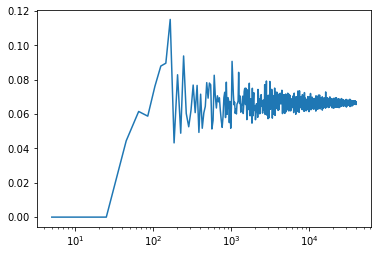
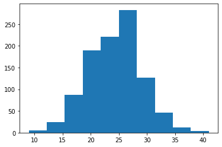
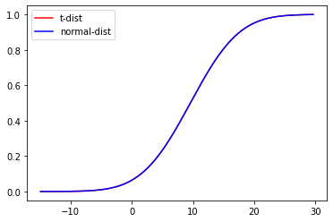

# Using distributions to analyse your data

# Background to this example

Data comes in all sorts and forms within Earth sciences, from long term
paleo records describing Oxygen levels in the atmosphere, timeseries of
river discharge and spatio-temporal satellite images monitoring the
vegetation. Within Earth Sciences we work with all these types of data
to understand the past, present and future of the Earth system. Before
we can work with these types of data we need to understand what we can
and cannot do with the data, which conclusion we can and cannot draw.

**In this practical you will learn about**

-   **Simple plots to look at your data**

-   **How to see which distribution can be used to describe the data**

-   **Which measures you can use to describe a distribution**

-   **How to check exceedance of thresholds**

-   **How to work with small samples and what distributions to use in
    that case**

# Getting started

Let's start with using Python again by opening your Conda environment
and then opening Spyder (for detailed instructions please look back at
the first practical). We start by loading some of the stand libraries in
this course. We use:

-   Pandas (data management and data handling)

-   Numpy (statistical analysis and data handling)

-   Matplotlib (plotting)

-   Scipy (statistical analysis)

``` python
import pandas as pd
import matplotlib.pyplot as plt
import numpy as np
import scipy.stats as stats
```

Now we are going to take a look at the first dataset which contains
information about the daily temperatures in the Netherlands. We tell
pandas to parse the date information, and use it as row labels:

``` python
Tas = pd.read_csv("../Data/dailyTemperature.csv", parse_dates=True, index_col=0).dropna()
Precip = pd.read_csv("../Data/dailyPrecipitation.csv", parse_dates=True, index_col=0).dropna()
Evap = pd.read_csv("../Data/dailyEvaporation.csv", parse_dates=True, index_col=0).dropna()
```

# Normal or not

Let's start with exploring different data sources, we want to identify
which distributions they follow.

#### Question 1

*Let's start with a visual inspection. A good way to start is to make a
histogram of you data. Use the cheat sheet to explore which function to
use to make a histograms of the different meteorological variables.*

As you might have seen some distributions are unlikely to be normal, but
we have another way of testing this using the QQ-plot.

#### Question 2

*Let's continue with a second visual inspection. Use your knowledge from
last week (or look back) to make a QQ plot of the meteorological
variables. What is your conclusion based on this analysis, are the
variables normally distributed?*

#### Question 3

*Try to implement the Shapiro Wilks test in Python on the different
dataset. You can use the function stats.shapiro, for which you find the
manual here:
<https://docs.scipy.org/doc/scipy/reference/generated/scipy.stats.shapiro.html>.*

#### Question 4

*Based on the different test, histogram, QQ-plot and statistical test
with Shapiro Wilks, what are your conclusions? They do not have to align
for the different tests.*

If we assume temperature to be normally distributed we can also derive
the two mean statistical properties, namely the mean and standard
deviation.

# Exploring the temperature data

#### Question 5

*Obtain the mean and standard deviation for the temperature record.*

Now that we got the mean and standard deviation we can calculate the
possibility of daily temperature exceeding certain thresholds. You can
use the
[stats.norm.cdf()](https://docs.scipy.org/doc/scipy/reference/generated/scipy.stats.norm.html)
function for this, and then provide the mean and standard deviation you
found earlier.

#### Question 6

*What is the chance of having a daily temperature above 20C*

If all is well you found that in roughly 5% of the days we have
temperatures above 20C in the Netherlands. If this number seems low to
you, mind you that we are here talking daily average temperatures and
not maximum temperatures that are often reported on the news.

A question we often hear in the media, is climate change already
happening and is the world really getting warmer? Let's test that for
the Netherlands.

#### Question 7

*Select the last 20 years on the record and compare those to the entire
record that we have. First select the years, calculate the new mean and
standard deviation and then see if we are more likely to observe
temperatures above 20C compared to the full record from 1901 onwards.*

If you did it well you find that the probability of Tas \> 20C has
increased from 5% to 7%. So far we have done this mostly with the
statistical approximiation of the data (e.g. a fitted normal
distribution), however we also have the real data available. As a tip
look at the startingPandas practical on how to test an entire dataframe
for a certain condition.

#### Question 8

*Count the number of days that exceed or equal \>= 20C for the entire
record and the last 20 years and convert these into fractions.*

If you did it well you find that in the total record we have 1436 days
with temperatures \>= 20C for a total of 45097 days, which results in
3.2% of the days. For the last 20 years we 420 years \>= 20C for a total
record length of 7305 which results in 5.7% of the days. As you can see
these numbers don't match the once you found for Question 7.

#### Question 9

*Using the QQ plot you made earlier, can you see a reason why the normal
distribution is not doing a good job for this assessment, especially for
the high values. Would you expect that the answers for Questions 7 and 8
are closer when looking at \<= 0C*

#### Question 10

*Repeat Questions 6, 7 and 8 but now for \<= 0C, was your initial
estimate correct?* If all went well you find that the chance of \<= 0C
temperatures is around 6.5% for the entire data record (depending on the
method used) and 4.1% for the last 20 years.

#### Question 11

*Can you conclude from your assessment of Tas \<= 0C that temperatures
are rising and that iceskating becomes less and less likely? Or would
you like to propose additional calculations or data requirements?*

Using the same weather data the [KNMI did an in-depth
assessment](https://www.knmi.nl/over-het-knmi/nieuws/laatste-elfstedentocht-nu-25-jaar-geleden/),
you can compare your answers to what they found and see if your finding
are in line.

# Exploring precipitation data

As you could already see from the Questions 2,3 and 4 the precipitation
data is certainly not normally distributed, it actually follows a
different type of distribution. You have learned a distribution has
multiple moments.

#### Question 12

*Obtain the first four moments for the precipitation data and don't
forget to use the dropna() function to ensure that you can calculate
those. You will have to rely on the [Scipy functions for summary
statistics](https://docs.scipy.org/doc/scipy/reference/stats.html#summary-statistics)*

You find that the precipitation violates the normal distribution
properties and is highly skewed. As a result precipitation often follows
a [gamma
distribution](https://en.wikipedia.org/wiki/Gamma_distribution), which
is bounded by zero with a long tail. In Python you can fit any kind of
distribution to your data and check if it makes sense. Below you find
example to fit both a normal and gamma distribution

``` python
mean, std = stats.norm.fit(Precip)
randomData = stats.norm.rvs(mean, std, size= len(Precip))
Precip.hist(alpha=0.5)
plt.hist(randomData, alpha=0.5)
plt.show()
```

``` python
alpha, loc, beta = stats.gamma.fit(Precip)
randomData = stats.gamma.rvs(alpha, loc, beta, size= len(Precip))
Precip.hist(alpha=0.5)
plt.hist(randomData, alpha=0.5)
plt.show()
```

You can see straight away that fitting the normal distribution is not
working for this example and the gamma distribution is more suited for
this purpose. We will not further explore this specific gamma
distribution, but you know now how to obtain the parameters for any
distribution in Python. We will now however further explore the annual
maximum precipitation event.

#### Question 13

*Start by resampling the precipitation data to obtain the annual maximum
value using the
[resample](https://pandas.pydata.org/docs/reference/api/pandas.DataFrame.resample.html)
function. After that make a histogram of the data and describe what you
see.*

#### Question 14

*Does the annual maximum precipitation reflect a normal distribution or
not?*

#### Question 13

*Now transform the data to a logarithmic and make a histogram plot does
it now reflect a normal distribution?*

If all is well you find that the logarithmic annual maximum
precipitation does approach a normal distribution. The advantage of this
is that we can now use all the tools and test we have available for the
normal distribution to test different hypothesis on the data.

# Exploring binominal and Poisson distributions

We can also ask ourselves the question how often does "x" happen, where
"x" is a certain event or extreme. Let's go back to the temperature data
and the iceskating example. In the Netherlands people are always
concerned whether or not we can have a Elf-stedentocht or when we can go
skating in general. Use the variable you created for Question 11, which
should be a dataframe that has True and False values from 1901 onwards.
We have already concluded that there is 6.5% chance of obtaining a day
\<= 0C. Let's assume that this value is the true chance of having a \<=
0C. We can start drawing random samples from the full dataset.

``` python
 ## To ensure we get the same random samples and thus the same answers.
np.random.seed(10)
sampleSize = 100
sampleData = Tas.sample(sampleSize)
fraction = sampleData[Tas <= 0].count()/sampleSize
print(fraction)
```

You find that the fraction is higher than the expected value of 6.5% or
0.065. This is because our sample size is insufficient to correctly
reflect the data observational record. Again this confirms that sample
size is very relevant when doing your work, getting enough data is key
in the real world and Geosciences as well. We will explore how many
samples we need using a for-loop.

``` python
## To ensure we get the same random samples and thus the same answers.
np.random.seed(10)
## Sample size
samplePoints = np.arange(5,40000,20)
## Empty array for the output
fraction = np.zeros(len(samplePoints))

## For-loop that loops over the samplePoints and at the same time over index numbers ranging from 0 to the length of the samplePoint variable
for s, i in zip(samplePoints, range(len(samplePoints))):
  sampleData = Tas.sample(s)
  fraction[i] = sampleData[Tas <= 10].count().iloc[0]/s
  
## Plotting the output with log x-axis
plt.plot(samplePoints, fraction, "-")
plt.xscale('log')
plt.show()
```

{width="679"}

You will observe that you need a rather large sample size to obtain the
"True" value of 6.5% and that it is still converging even with 40000
samples present.

#### Question 14

*Do you think it will take longer or shorter to obtain the "True"
exceedance of a value if you take a threshold with a higher probability,
for example 10C. Test this with the script above and provide the figure*

We can also ask ourselves the question how many days will we get in the
coming year that have temperature \<= 0C. For this we can use the
Poisson distribution to generate likely distributions of freezing
temperatures in every year. We know from the previous analysis that we
have 3004 days that \<= 0C for a total record length of 45097 days,
which mean on average we have 3004/45097\*365.25 = 24.33 days with \<=
0C per year on average since 1901. Now lets plot a Poisson distribution.

``` python
np.random.seed(10)
avgDays = 24.33
randomYears = stats.poisson.rvs(avgDays, size=1000)
plt.hist(randomYears)
```

{width="676"}

#### Question 15

*We can also use the Poisson distribution to ask questions like what is
the likelihood of having less than 15 freezing day? Use the
[stats.poisson.cdf(k,
mu)](https://docs.scipy.org/doc/scipy/reference/generated/scipy.stats.poisson.html)
to find the chance of having less than 15 freezing days in a given
year.*

#### Question 16

*If you have paid carefull attention you might have noticed that in this
case the Poisson distribution is approaching a normal distribution. This
means again that we the Central Limit Theory comes into play. Now please
lower the probability of 24.33 to something like 3 days per year does
this still approach a normal distribution and if not why not?*

# Using a t-distribution

When we are working with problems that have small samples size, for
example the field observations where sample sizes might be as low as
several measurements maybe up to a 100. Since in these measurements the
true variance of the mean is unknown, it must be approximated by the
sample standard error of the mean. And the ratio between the sample mean
and the standard error had a distribution that is called the
t-distribution, and converges for larger values towards the normal
distribution.

We can both the normal and distribution for the Temperature dataset with
the fitting information from Question 12. We first fit both a
t-distribution and a normal distribution and then plot the cumalative
density function (CDF) for both distributions.

``` python
tStat, loc, scale = stats.t.fit(Tas)
mean, std = stats.norm.fit(Tas)

xLocs = np.arange(Tas.min().iloc[0], Tas.max().iloc[0], 0.05)

plt.plot(xLocs, stats.t.cdf(xLocs, tStat, loc, scale), "-", color = "Red", label="t-dist")
plt.plot(xLocs, stats.norm.cdf(xLocs, mean, std), "-", color = "Blue", label="normal-dist")
plt.legend()
plt.show()
```

{width="680"}

#### Question 17

*Do you think there is a significant difference between the
t-distribution and the normal distribution?*

Now we will run the same experiment on a smaller data sample. First we
create the subset of the temperature data.

``` python
np.random.seed(10)
sampleSize = 100
sampleData = Tas.sample(sampleSize)
```

#### Question 18

*What happens if you use a smaller subset of the temperature data, does
the t-distribution still approximates the normal distribution of the
full dataset? Adjust the codes about to show the CDF plot of the
sampleData and describe your interpretation of the CDF.*

# Do your own data exploration

``` python
Q = pd.read_csv("../RawData/Rhine_total.txt", parse_dates=True, index_col=0)
```

#### Question 19

*You have loaded the daily discharge data for the Rhine river, now start
and exploring. You should make the following things:*

-   *Some plots that allow you to understand what the data looks like*

-   *Describe some relevant statistical values*

-   *Describe if the data is normal or not and why*

-   *Answer the questions:*

    -   *How often do we get floods above 8000m^3^s^-1^*

    -   *How often do we go below 1000*

-   *Create a Poisson distribution for both flood and drought*

-   *Calculate the exceedance for flood and drought*

    -   *Tip you can calculate the annual occurrence by comparing the
        values to your threshold*

    -   *Then resample to yearly values*

    -   *Then calculate the number of times you actually have a value*

    -   *Flood: Q\[Q\>8000\].resample("YE").count()*

    -   *Drought: Q\[Q\<1000\].resample("YE").count()*

-   *Can you hypothesis why the Poisson distribution doesn't work for
    the drought example?*

# What you have learned today

**If all is well you have learned today:**

-   **Simple plots to look at your data**

-   **How to see which distribution can be used to describe the data**

-   **Which measures you can use to describe a distribution**

-   **How to check exceedance of thresholds**

-   **How to work with small samples and what distributions to use in
    that case**
