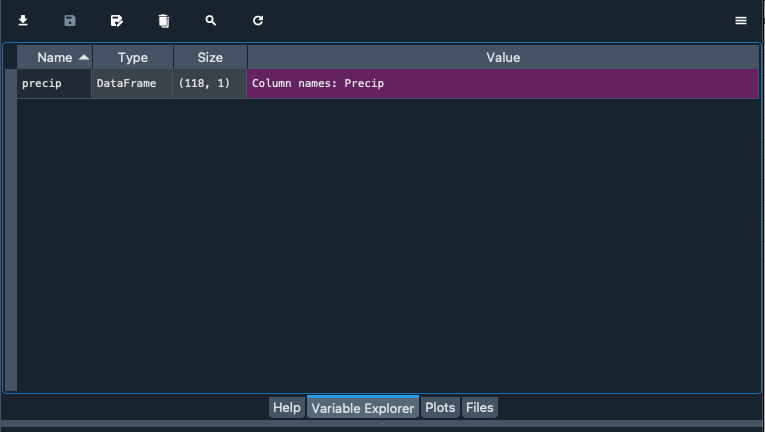
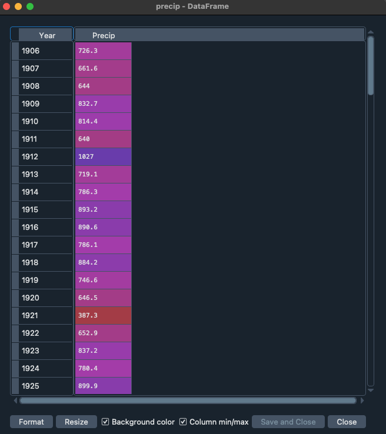
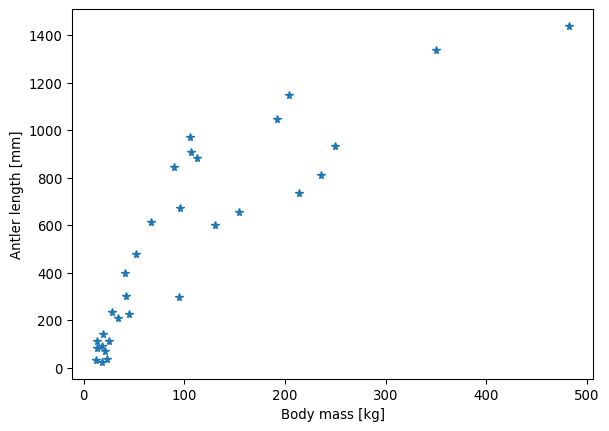
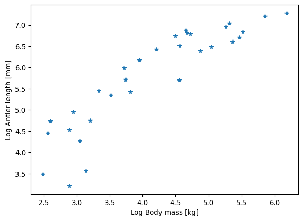

# Getting started with data analysis

# Background to this example

Data comes in all sorts and forms within Earth sciences, from long term paleo records describing Oxygen levels in the atmosphere, timeseries of river discharge and spatio-temporal satellite images monitoring the vegetation. Within Earth Sciences we work with all these types of data to understand the past, present and future of the Earth system. Before we can work with these types of data we need to understand what we can and cannot do with the data, which conclusion we can and cannot draw.

**In this practical we will start looking at different types of data and distributions of these data to get a better understanding of the different types of data and their distributions.**

Let's start with using Python again by opening your Conda environment and then opening Spyder (for detailed instructions please look back at the first practical). We start by loading some of the stand libraries in this course. We use:

-   Pandas (data management and data handling)

-   Numpy (statistical analysis and data handling)

-   Matplotlib (plotting)

## Code

``` python
import pandas as pd
import matplotlib.pyplot as plt
import numpy as np
```

Now we are going to take a look at the first dataset which contains information about the amount of precipitation in the Netherlands.

``` python
precip = pd.read_csv("../Data/annualPrecipitation.csv", index_col=0)
```

In this dataset you find the annual sum of precipitation in the last century. The data is now stored in the variable *precip.* You can explore the data by looking at the data within this variable with:

``` python
precip.head()
```

Alternatively you can explore the data with the variable explorer that you find within Spyder





Gould (1974) didn’t provide the dataset in his paper, which in 1974 is forgiveable. His study was replicated by Plard et al. (2011) who included a dataset in an appendix. This dataset has been converted to `csv` for you:

``` python
antler_dataset = pd.read_csv('../Data/Antler_allometry.csv')
```

Preview the dataset:

``` python
antler_dataset.head()
```

<div>

```{=html}
<style scoped>
    .dataframe tbody tr th:only-of-type {
        vertical-align: middle;
    }
&#10;    .dataframe tbody tr th {
        vertical-align: top;
    }
&#10;    .dataframe thead th {
        text-align: right;
    }
</style>
```
|     | Sub-family | Genus  | Species     | Common name       | Antler_length | Male_body_mass | Female_body_mass |
|---------|---------|---------|---------|---------|---------|---------|---------|
| 0   | Cervinae   | Axis   | axis        | chital            | 845.0         | 89.5           | 39.0             |
| 1   | Cervinae   | Axis   | porcinus    | hog deer          | 399.0         | 41.0           | 31.0             |
| 2   | Cervinae   | Cervus | albirostris | white-lipped deer | 1150.0        | 204.0          | 125.0            |
| 3   | Cervinae   | Cervus | canadensis  | wapiti            | 1337.0        | 350.0          | 250.0            |
| 4   | Cervinae   | Cervus | duvaucelii  | barasingha        | 813.0         | 236.0          | 145.0            |

</div>

Preview the bivariate distribution of the body mass and antler length:

``` python
fig, ax = plt.subplots()
ax.plot(antler_dataset.Male_body_mass, antler_dataset.Antler_length, '*')
ax.set_ylabel('Antler length [mm]')
ax.set_xlabel('Body mass [kg]')
```

```         
Text(0.5, 0, 'Body mass [kg]')
```



This plot doesn’t look like a straight line, does it? Many variables, such as those related to surface and volume, grow as powers of the linear dimensions, e.g. the body mass tends to grow as the cube of the body length. Based on an understanding of how a variable scales, you could try different transformations, such as cube root of the body mass. But let’s follow Gould’s (1974) original approach and apply a log transformation.

``` python
fig, ax = plt.subplots()
ax.plot(np.log(antler_dataset.Male_body_mass), np.log(antler_dataset.Antler_length), '*')
ax.set_ylabel('Log Antler length [mm]')
ax.set_xlabel('Log Body mass [kg]')
```

```         
Text(0.5, 0, 'Log Body mass [kg]')
```



In this plot the log-transformed variables lie along a line, to which you can fit an ordinary least-squares (OLS) regression model using `pandas`:

``` python
model_fit = smf.ols('np.log(Antler_length)~np.log(Male_body_mass)', antler_dataset).fit()
print(model_fit.summary2())
```

```         
                   Results: Ordinary least squares
======================================================================
Model:              OLS                   Adj. R-squared:     0.801   
Dependent Variable: np.log(Antler_length) AIC:                50.0742 
Date:               2024-06-18 21:49      BIC:                52.9421 
No. Observations:   31                    Log-Likelihood:     -23.037 
Df Model:           1                     F-statistic:        121.9   
Df Residuals:       29                    Prob (F-statistic): 6.68e-12
R-squared:          0.808                 Scale:              0.27667 
----------------------------------------------------------------------
                          Coef.  Std.Err.    t    P>|t|  [0.025 0.975]
----------------------------------------------------------------------
Intercept                 1.6811   0.3838  4.3803 0.0001 0.8962 2.4661
np.log(Male_body_mass)    0.9904   0.0897 11.0396 0.0000 0.8069 1.1739
----------------------------------------------------------------------
Omnibus:                4.515          Durbin-Watson:            1.659
Prob(Omnibus):          0.105          Jarque-Bera (JB):         3.444
Skew:                   -0.812         Prob(JB):                 0.179
Kurtosis:               3.167          Condition No.:            18   
======================================================================
Notes:
[1] Standard Errors assume that the covariance matrix of the errors is
correctly specified.
```

## Exercises

### Open Task 1: extract the regression equation

Extract the slope and intercept of the regression line from the model summary and use the previous plot to overlie the fitted line using the extracted parameters. What is the equation of the regression line?

### Open Task 2: Goodness of fit

Extract the **coefficient of determination** from the model summary and place it in the corner of the plot. Does the linear model describe the dataset well? What values does the coefficient of determination take?

### Open Task 3: Statistical test(s) of the model

The model summary provides the p-values and 95% confidence intervals for the slope and the intercept of the regression line.

1.  What is the null hypothesis for the test of the slope?

2.  The confidence interval tells you whether you can reject the null hypothesis. What do you have to conclude in the interpretation of the results if the confidence interval includes zero?

3.  What is the null hypothesis in the test of the intercept? What do the confidence intervals tell you? Visualize the confidence intervals for the intercept on the plot.

# References

-   Gould, S. J. (1974). The origin and function of’bizarre’structures: antler size and skull size in the’Irish Elk,’Megaloceros giganteus. Evolution, 191-220.

-   Plard, F., Bonenfant, C., & Gaillard, J. M. (2011). Revisiting the allometry of antlers among deer species: male–male sexual competition as a driver. Oikos, 120(4), 601-606.
