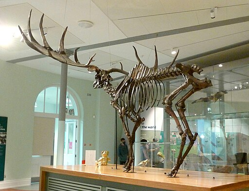
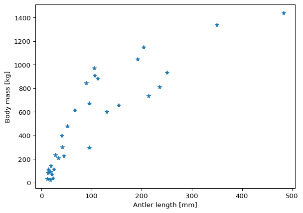
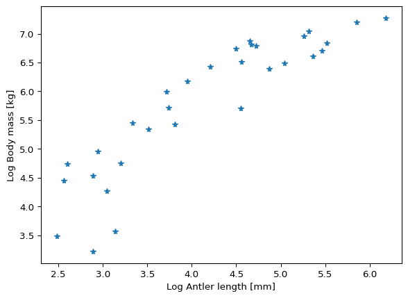

# Linear regression: debunking sexual selection


# Background to this example

The [Irish deer *Megaloceros
giganteus*](https://en.wikipedia.org/wiki/Irish_elk), formerly called
the Irish elk, is one of the iconic members of the Ice Age fauna. Now
extinct, it reached some 2.1 m shoulder height and it massive antlers
spanned up to 3.6 m. In modern deer, large antlers and scary display of
them predict a high success among femals and thus a high reproductive
success. This is an example of **sexual selection**, through which
mating “decorations” or behaviors undergo positive selection, even
though they may have no other use in one sex other than impressing its
potential mating partners. This must have appealed to the Victorian
prudery and the “survival of the sexiest”.



Linear regression is how you can tell whether this spicy explanation is
correct, as has been done by the evolutinonary biologist Steven J. Gould
(1974). He measured the shoulder heights and antler lengths of deer
species of various sizes and showed that they fell on a line that
describes the relationship. The antler length for the Irish elk was
exactly as predicted based on this relationship for smaller deer.
Indeed, the Irish deer survived for tens of thousands of years with its
giant antlers and fared well until the end of the Pleistocene. Like many
animals of the Pleistocene megafauna, its extinstion is attributed to
climate change and hunting by early humans.

Can you replicate Gould’s landmark study?

## Code

``` python
import pandas as pd
import matplotlib.pyplot as plt
import statsmodels.formula.api as smf
import numpy as np
```

Gould (1974) didn’t provide the dataset in his paper, which in 1974 is
forgiveable. His study was replicated by Plard et al. (2011) who
included a dataset in an appendix. This dataset has been converted to
`csv` for you:

``` python
antler_dataset = pd.read_csv('../Data/Antler_allometry.csv')
```

Preview the dataset:

``` python
antler_dataset.head()
```

<div>
<style scoped>
    .dataframe tbody tr th:only-of-type {
        vertical-align: middle;
    }
&#10;    .dataframe tbody tr th {
        vertical-align: top;
    }
&#10;    .dataframe thead th {
        text-align: right;
    }
</style>

|     | Sub-family | Genus  | Species     | Common name       | Antler_length | Male_body_mass | Female_body_mass |
|-----|------------|--------|-------------|-------------------|---------------|----------------|------------------|
| 0   | Cervinae   | Axis   | axis        | chital            | 845.0         | 89.5           | 39.0             |
| 1   | Cervinae   | Axis   | porcinus    | hog deer          | 399.0         | 41.0           | 31.0             |
| 2   | Cervinae   | Cervus | albirostris | white-lipped deer | 1150.0        | 204.0          | 125.0            |
| 3   | Cervinae   | Cervus | canadensis  | wapiti            | 1337.0        | 350.0          | 250.0            |
| 4   | Cervinae   | Cervus | duvaucelii  | barasingha        | 813.0         | 236.0          | 145.0            |

</div>

Preview the bivariate distribution of the body mass and antler length:

``` python
fig, ax = plt.subplots()
ax.plot(antler_dataset.Male_body_mass, antler_dataset.Antler_length, '*')
ax.set_ylabel('Antler length [mm]')
ax.set_xlabel('Body mass [kg]')
```

    Text(0.5, 0, 'Body mass [kg]')



This plot doesn’t look like a straight line, does it? Many variables,
such as those related to surface and volume, grow as powers of the
linear dimensions, e.g. the body mass tends to grow as the cube of the
body length. Based on an understanding of how a variable scales, you
could try different transformations, such as cube root of the body mass.
But let’s follow Gould’s (1974) original approach and apply a log
transformation.

``` python
fig, ax = plt.subplots()
ax.plot(np.log(antler_dataset.Male_body_mass), np.log(antler_dataset.Antler_length), '*')
ax.set_ylabel('Log Antler length [mm]')
ax.set_xlabel('Log Body mass [kg]')
```

    Text(0.5, 0, 'Log Body mass [kg]')



In this plot the log-transformed variables lie along a line, to which
you can fit an ordinary least-squares (OLS) regression model using
`pandas`:

``` python
model_fit = smf.ols('np.log(Antler_length)~np.log(Male_body_mass)', antler_dataset).fit()
print(model_fit.summary2())
```

                       Results: Ordinary least squares
    ======================================================================
    Model:              OLS                   Adj. R-squared:     0.801   
    Dependent Variable: np.log(Antler_length) AIC:                50.0742 
    Date:               2024-06-02 19:02      BIC:                52.9421 
    No. Observations:   31                    Log-Likelihood:     -23.037 
    Df Model:           1                     F-statistic:        121.9   
    Df Residuals:       29                    Prob (F-statistic): 6.68e-12
    R-squared:          0.808                 Scale:              0.27667 
    ----------------------------------------------------------------------
                              Coef.  Std.Err.    t    P>|t|  [0.025 0.975]
    ----------------------------------------------------------------------
    Intercept                 1.6811   0.3838  4.3803 0.0001 0.8962 2.4661
    np.log(Male_body_mass)    0.9904   0.0897 11.0396 0.0000 0.8069 1.1739
    ----------------------------------------------------------------------
    Omnibus:                4.515          Durbin-Watson:            1.659
    Prob(Omnibus):          0.105          Jarque-Bera (JB):         3.444
    Skew:                   -0.812         Prob(JB):                 0.179
    Kurtosis:               3.167          Condition No.:            18   
    ======================================================================
    Notes:
    [1] Standard Errors assume that the covariance matrix of the errors is
    correctly specified.

## Exercises

### Open Task 1: extract the regression equation

Extract the slope and intercept of the regression line from the model
summary and use the previous plot to overlie the fitted line using the
extracted parameters. What is the equation of the regression line?

### Open Task 2: Goodness of fit

Extract the **coefficient of determination** from the model summary and
place it in the corner of the plot. Does the linear model describe the
dataset well? What values does the coefficient of determination take?

### Open Task 3: Statistical test(s) of the model

The model summary provides the p-values and 95% confidence intervals for
the slope and the intercept of the regression line.

1.  What is the null hypothesis for the test of the slope?

2.  The confidence interval tells you whether you can reject the null
    hypothesis. What do you have to conclude in the interpretation of
    the results if the confidence interval includes zero?

3.  What is the null hypothesis in the test of the intercept? What do
    the confidence intervals tell you? Visualize the confidence
    intervals for the intercept on the plot.

# References

- Gould, S. J. (1974). The origin and function of’bizarre’structures:
  antler size and skull size in the’Irish Elk,’Megaloceros giganteus.
  Evolution, 191-220.

- Plard, F., Bonenfant, C., & Gaillard, J. M. (2011). Revisiting the
  allometry of antlers among deer species: male–male sexual competition
  as a driver. Oikos, 120(4), 601-606.
