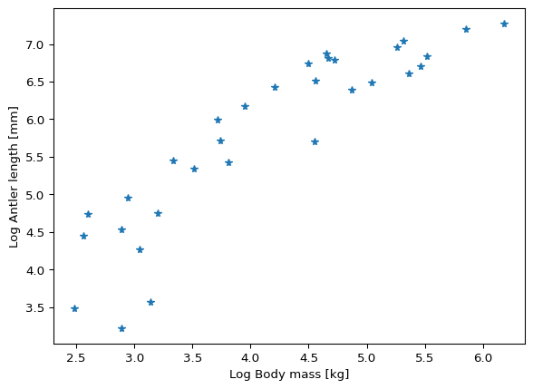

# Linear regression


# Linear regression: debunking sexual selection

## Background to this example

The [Irish deer *Megaloceros
giganteus*](https://en.wikipedia.org/wiki/Irish_elk), formerly called
the Irish elk, is one of the iconic members of the Ice Age fauna. Now
extinct, it reached some 2.1 m shoulder height and it massive antlers
spanned up to 3.6 m. In modern deer, large antlers and scary display of
them predict a high success among femals and thus a high reproductive
success. This is an example of **sexual selection**, through which
mating “decorations” or behaviors undergo positive selection, even
though they may have no other use in one sex other than impressing its
potential mating partners. This must have appealed to the Victorian
prudery and the “survival of the sexiest”.

.JPG)

Linear regression is how you can tell whether this spicy explanation is
correct, as has been done by the evolutinonary biologist Steven J. Gould
(1974). He measured the shoulder heights and antler lengths of deer
species of various sizes and showed that they fell on a line that
describes the relationship. The antler length for the Irish elk was
exactly as predicted based on this relationship for smaller deer.
Indeed, the Irish deer survived for tens of thousands of years with its
giant antlers and fared well until the end of the Pleistocene. Like many
animals of the Pleistocene megafauna, its extinstion is attributed to
climate change and hunting by early humans.

Can you replicate Gould’s landmark study?

## Code

``` python
import pandas as pd
import matplotlib.pyplot as plt
import statsmodels.formula.api as smf
import numpy as np
```

Gould (1974) didn’t provide the dataset in his paper, which in 1974 is
forgiveable. His study was replicated by Plard et al. (2011) who
included a dataset in an appendix. This dataset has been converted to
`csv` for you:

``` python
antler_dataset = pd.read_csv('../Data/Antler_allometry.csv')
```

Preview the dataset:

``` python
antler_dataset.head
```

    <bound method NDFrame.head of       Sub-family          Genus        Species        Common name  \
    0       Cervinae           Axis           axis             chital   
    1       Cervinae           Axis       porcinus           hog deer   
    2       Cervinae         Cervus    albirostris  white-lipped deer   
    3       Cervinae         Cervus     canadensis             wapiti   
    4       Cervinae         Cervus     duvaucelii         barasingha   
    5       Cervinae         Cervus        elaphus           red deer   
    6       Cervinae         Cervus           eldi         Eld’s deer   
    7       Cervinae         Cervus         nippon          sika deer   
    8       Cervinae         Cervus     timorensis         Timor deer   
    9       Cervinae         Cervus       unicolor             sambar   
    10      Cervinae           Dama           dama        fallow deer   
    11      Cervinae      Elaphurus     davidianus  Père David’s deer   
    12   Muntiacinae      Elaphodus    cephalophus        tufted deer   
    13   Muntiacinae  Megamuntiacus   vuquangensis     giant muntjack   
    14   Muntiacinae      Muntiacus     crinifrons      black muntjac   
    15   Muntiacinae      Muntiacus  gongshanensis   Gongshan muntjak   
    16   Muntiacinae      Muntiacus        muntjak            muntjak   
    17   Muntiacinae      Muntiacus     putaoensis          leaf deer   
    18   Muntiacinae      Muntiacus        reevesi    Chinese muntjak   
    19  Odocoileinae          Alces          alces              moose   
    20  Odocoileinae    Blastocerus     dichotomus         marsh deer   
    21  Odocoileinae      Capreolus      capreolus   Western roe deer   
    22  Odocoileinae      Capreolus       pygargus   eastern roe deer   
    23  Odocoileinae   Hippocamelus       bisculus     Chilean guemal   
    24  Odocoileinae         Mazama      americana        red brocket   
    25  Odocoileinae         Mazama    gouazoupira       gray brocket   
    26  Odocoileinae     Odocoileus       hemionus          mule deer   
    27  Odocoileinae     Odocoileus    virginianus  white-tailed deer   
    28  Odocoileinae     Ozotoceros    bezoarticus        pampas deer   
    29  Odocoileinae           Pudu           puda    south pudu deer   
    30  Odocoileinae       Rangifer       tarandus           reindeer   

        Antler_length  Male_body_mass  Female_body_mass  Unnamed: 7  
    0           845.0            89.5              39.0         NaN  
    1           399.0            41.0              31.0         NaN  
    2          1150.0           204.0             125.0         NaN  
    3          1337.0           350.0             250.0         NaN  
    4           813.0           236.0             145.0         NaN  
    5           936.0           250.0             125.0         NaN  
    6           971.5           105.0              67.0         NaN  
    7           480.0            52.0              37.0         NaN  
    8           675.0            95.5              53.0         NaN  
    9          1049.0           192.0             146.0         NaN  
    10          615.0            67.0              44.0         NaN  
    11          737.0           214.0             159.0         NaN  
    12           25.0            18.0              18.0         NaN  
    13          227.5            45.0              34.0         NaN  
    14           35.5            23.0              24.1         NaN  
    15           71.7            21.0              16.0         NaN  
    16          142.0            19.0              20.0         NaN  
    17           32.5            12.0              12.0         NaN  
    18          114.0            13.5              14.0         NaN  
    19         1440.0           482.5             365.0         NaN  
    20          600.0           130.0             100.0         NaN  
    21          233.5            28.0              26.5         NaN  
    22          304.5            42.0              39.5         NaN  
    23          300.0            95.0              75.0         NaN  
    24          115.0            24.5              24.5         NaN  
    25           92.5            18.0              18.0         NaN  
    26          885.0           112.5              55.5         NaN  
    27          656.0           154.5              68.5         NaN  
    28          210.0            33.5              33.5         NaN  
    29           85.0            13.0              13.5         NaN  
    30          910.0           106.5              76.0         NaN  >

Preview the bivariate distribution of the body mass and antler length:

``` python
fig, ax = plt.subplots()
ax.plot(antler_dataset.Male_body_mass, antler_dataset.Antler_length, '*')
ax.set_xlabel('Antler length [mm]')
ax.set_ylabel('Body mass [kg]')
```

    Text(0, 0.5, 'Body mass [kg]')


This plot doesn’t look like a straight line, does it? Many variables,
such as those related to surface and volume, grow as powers of the
linear dimensions, e.g. the body mass tends to grow as the cube of the
body length. Based on an understanding of how a variable scales, you
could try different transformations, such as cube root of the body mass.
But let’s follow Gould’s (1974) original approach and apply a log
transformation.

``` python
fig, ax = plt.subplots()
ax.plot(np.log(antler_dataset.Male_body_mass), np.log(antler_dataset.Antler_length), '*')
ax.set_xlabel('Log Antler length [mm]')
ax.set_ylabel('Log Body mass [kg]')
```

    Text(0, 0.5, 'Log Body mass [kg]')



In this plot the log-transformed variables lie along a line, to which
you can fit an ordinary least-squares (OLS) regression model using
`pandas`:

``` python
model_fit = smf.ols('np.log(Antler_length)~np.log(Male_body_mass)', antler_dataset).fit()
print(model_fit.summary2())
```

                       Results: Ordinary least squares
    ======================================================================
    Model:              OLS                   Adj. R-squared:     0.801   
    Dependent Variable: np.log(Antler_length) AIC:                50.0742 
    Date:               2024-06-02 18:41      BIC:                52.9421 
    No. Observations:   31                    Log-Likelihood:     -23.037 
    Df Model:           1                     F-statistic:        121.9   
    Df Residuals:       29                    Prob (F-statistic): 6.68e-12
    R-squared:          0.808                 Scale:              0.27667 
    ----------------------------------------------------------------------
                              Coef.  Std.Err.    t    P>|t|  [0.025 0.975]
    ----------------------------------------------------------------------
    Intercept                 1.6811   0.3838  4.3803 0.0001 0.8962 2.4661
    np.log(Male_body_mass)    0.9904   0.0897 11.0396 0.0000 0.8069 1.1739
    ----------------------------------------------------------------------
    Omnibus:                4.515          Durbin-Watson:            1.659
    Prob(Omnibus):          0.105          Jarque-Bera (JB):         3.444
    Skew:                   -0.812         Prob(JB):                 0.179
    Kurtosis:               3.167          Condition No.:            18   
    ======================================================================
    Notes:
    [1] Standard Errors assume that the covariance matrix of the errors is
    correctly specified.

## Exercises

### Open Task 1: extract the regression equation

Extract the slope and intercept of the regression line from the model
summary and use the previous plot to overlie the fitted line using the
extracted parameters. What is the equation of the regression line?

### Open Task 2: Goodness of fit

Extract the **coefficient of determination** from the model summary and
place it in the corner of the plot. Does the linear model describe the
dataset well? What values does the coefficient of determination take?

### Open Task 3: Statistical test(s) of the model

The model summary provides the p-values and 95% confidence intervals for
the slope and the intercept of the regression line.

1.  What is the null hypothesis for the test of the slope?

2.  The confidence interval tells you whether you can reject the null
    hypothesis. What do you have to conclude in the interpretation of
    the results if the confidence interval includes zero?

3.  What is the null hypothesis in the test of the intercept? What do
    the confidence intervals tell you? Visualize the confidence
    intervals for the intercept on the plot.

# References

- Gould, S. J. (1974). The origin and function of’bizarre’structures:
  antler size and skull size in the’Irish Elk,’Megaloceros giganteus.
  Evolution, 191-220.

- Plard, F., Bonenfant, C., & Gaillard, J. M. (2011). Revisiting the
  allometry of antlers among deer species: male–male sexual competition
  as a driver. Oikos, 120(4), 601-606.
